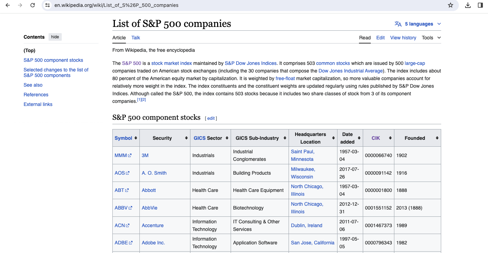
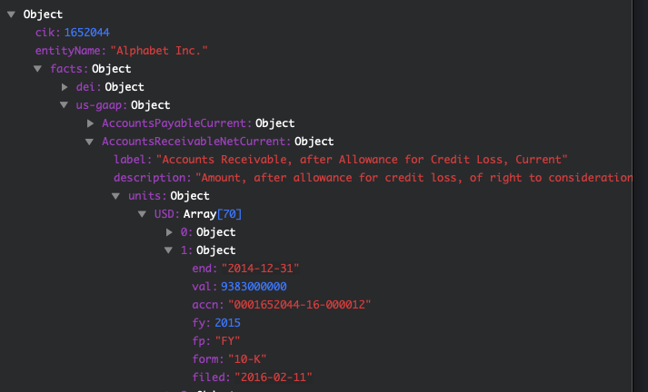
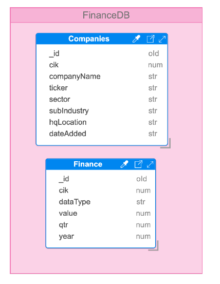

# Project-Three

## Overview
For this project we researched financial records provided by the SEC. The records detail a variety of elements: revenue, gross profit, operating and net income loss, research and development expense, selling and marketing expense, share based and allocated share based expense depreciation, cost and expenses, general and administrative expense interest expense, lease and rental expense, marketing and advertising expense, accrued liabilities, entity common stock shares, and entity public float. We looked at records for a numerous companies and decided to present our findings using the data engineering route. We conducted an analysis of the records provided by the SEC in Jupyter Notebook and were able to extract data to import onto MongoDB.

### Key Terms 

* **S&P 500** - The Standard and Poor's 500, or simply the S&P 500, is a stock market index tracking the stock performance of 500 of the largest companies listed on stock exchanges in the United States.

* **SEC** - The U.S. **Securities and Exchange Commission** is an independent agency of the United States federal government, created in the aftermath of the Wall Street Crash of 1929. The primary purpose of the SEC is to enforce the law against market manipulation.

* **EDGAR** - Electronic Data Gathering, Analysis, and Retrieval is an internal database system that performs automated collection, validation, indexing, accepted forwarding of submissions by companies and others who are required by law to file forms with the U.S. Securities and Exchange Commission.

* **CIK** - Central Index Key - Unique key that identifies a company in SEC Database

* **SEC Form 8K** - Current Report - It is the report that companies must file with the SEC to announce major events that shareholders should know about. 

* **SEC Form 10Q** - Quarterly Report - It is a comprehensive quarterly report of financial performance submitted by all public companies to the SEC.

* **SEC Form 10K** - Annual Report - It is a a comprehensive report filed annually by a publicly-traded company about its financial performance.

* **SEC Form 10Q A** - Quarterly Report Amendment. 

* **SEC Form 10K A** - Annual Report Amendment.  
 

## Source Data
1. Details of compaines included in the S&P 500 index - https://en.wikipedia.org/wiki/List_of_S%26P_500_companies   

* Screenshot of S&P 500 companies listed in the Wikipedia page

2. Finance data of companies as reported to SEC - https://data.sec.gov/api/xbrl/companyfacts/CIK0001701605.json 

* Sample data format of finance data as recevied from SEC Data API

## Database Design 

## ETL

### Extract

* The CIK IDs for S&P 500 companies are obtained by web scraping WikiPedia page 'https://en.wikipedia.org/wiki/List_of_S%26P_500_companies'. This is handled by notebook kept under "source/SP500". The company data is saved under 'data/input/SP500.csv'

* The finance data is extracted from SEC Website https://data.sec.gov/api/xbrl/companyfacts/ for each CIK IDs in the S&P500 Index. 

* SEC allows automated download of data from the API only if the following header is setup in the HTTP request

headers = {
    'User-Agent' : email_id,
    'Host' : 'data.sec.gov'
}

### Transform

The data for the following forms are considered for transformation:
* 8K, 10Q, 10K, 10Q/A, 10K/A 

There are multiple filings found in the data for the same reporting period. The latest filings are only kept to reflect the most recently updated information.\ 

The reporting period is extracted based on 'start' and 'end' period provided in each filing. The annual filings are identified as quarter 0 (zero) and quartetly filings are identified as 1 thru 4 depending on the reporting quarter.

### Load
The JSON data is constructed based on the database design. The data is loaded into MongoDB database using 'mongoimport' command

## API

### Company API

Company API provides endpoint to query company collection.
Following routes are available:

* /api/v1.0/company/all - Retrieve data on all the companies present in the collection
* /api/v1.0/company/ticker/<ticker> - Look up company data by ticker symbol
* /api/v1.0/company/name/<name> - Look up company data by name
* /api/v1.0/company/sector/<sector> - Look up companies by sector
* /api/v1.0/company/subindustry/<subindustry> - Look up companies by sub industry
* /api/v1.0/company/hqlocation/<hqlocation> - Look up companies by Headquarters Location
* /api/v1.0/company/cik/<cik> - Look up company data by CIK ID

### Finance API

Finance API provides endpoint to query finance collection.
Following route is available:

* api/v1.0/finance/query - Retrieve finance data based on the query input

Here is a sample finance query that pulls 'NetIncomeLoss' data for year 2023 for CIKs 1551152 & 4977\

sample_finance_query = {
    "finance_data_query" : {
        "dataType" : ["NetIncomeLoss"],
        "qtr" : 0,
        "year" : 2023,
        "cik" : [1551152, 4977]
    } 
}

## MongoDB Atlas

MongoDB Atlas is a cloud offering of MongoDB database. In addition to providing managed MongoDB instance, there is a **Charts** feature which can used to create charts based on the data data available in MongoDB database. 

* [S&P 500 Dashboard](https://charts.mongodb.com/charts-project-0-uzzhy/public/dashboards/e915b487-9d16-40d0-b721-fc4991110089)
* [Google Dashboard](https://charts.mongodb.com/charts-project-0-uzzhy/public/dashboards/65e13bf2-3629-42b0-838a-414a7900f716)

## References:
* https://www.sec.gov/edgar/sec-api-documentation

